# Задания по треку 📈 «Сервис сбора метрик и алертинга»

[](https://github.com/xhrobj/go-metrics-and-alerts/actions/workflows/go-ci.yml)
[](https://sonarcloud.io/summary/new_code?id=xhrobj_go-metrics-and-alerts)
[](https://sonarcloud.io/summary/new_code?id=xhrobj_go-metrics-and-alerts)

## Спринт 1

### Инкремент 1

Разработайте сервер для сбора рантайм-метрик, который будет собирать репорты от агентов по протоколу HTTP. Агент вы реализуете в следующем инкременте — в качестве источника метрик вы будете использовать пакет `runtime`.

Сервер должен быть доступен по адресу `http://localhost:8080`, а также:

- Принимать и хранить произвольные метрики двух типов:
    - Тип `gauge`, `float64` — новое значение должно замещать предыдущее.
    - Тип `counter`, `int64` — новое значение должно добавляться к предыдущему, если какое-то значение уже было известно серверу.
- Принимать метрики по протоколу HTTP методом POST.
- Принимать данные в формате `http://<АДРЕС_СЕРВЕРА>/update/<ТИП_МЕТРИКИ>/<ИМЯ_МЕТРИКИ>/<ЗНАЧЕНИЕ_МЕТРИКИ>`, `Content-Type: text/plain`.
- При успешном приёме возвращать `http.StatusOK`.
- При попытке передать запрос без имени метрики возвращать `http.StatusNotFound`.
- При попытке передать запрос с некорректным типом метрики или значением возвращать `http.StatusBadRequest`.

Редиректы не поддерживаются.

Для хранения метрик объявите тип `MemStorage`. Рекомендуем использовать тип `struct` с полем-коллекцией внутри (`slice` или `map`). В будущем это позволит добавлять к объекту хранилища новые поля — например, логгер или мьютекс, чтобы можно было использовать их в методах. Опишите интерфейс для взаимодействия с этим хранилищем.

Пример запроса к серверу:

```
POST /update/counter/someMetric/527 HTTP/1.1
Host: localhost:8080
Content-Length: 0
Content-Type: text/plain
```

Пример ответа от сервера:

```
HTTP/1.1 200 OK
Date: Tue, 21 Feb 2026 02:51:35 GMT
Content-Length: 11
Content-Type: text/plain; charset=utf-8
```

**Тесты**

```
curl -i -X POST http://localhost:8080/update/gauge/test/1.23
curl -i -X POST http://localhost:8080/update/counter/test/10
curl -i -X POST http://localhost:8080/update/counter/test/abc   # 400
curl -i http://localhost:8080/update/gauge/test/1.23            # 405
```

**Задачи**

- #1. Добавить/сконфигурировать Сервер и update-handler
- #2. Реализовать MemStorage

---

### Инкремент 2

Разработайте агент (HTTP-клиент) для сбора рантайм-метрик и их последующей отправки на сервер по протоколу HTTP.

Агент должен собирать метрики двух типов:

- Тип `gauge`, `float64`.
- Тип `counter`, `int64`.

В качестве источника метрик используйте пакет `runtime`.

Нужно собирать следующие метрики типа `gauge`:

- `Alloc`
- `BuckHashSys`
- `Frees`
- `GCCPUFraction`
- `GCSys`
- `HeapAlloc`
- `HeapIdle`
- `HeapInuse`
- `HeapObjects`
- `HeapReleased`
- `HeapSys`
- `LastGC`
- `Lookups`
- `MCacheInuse`
- `MCacheSys`
- `MSpanInuse`
- `MSpanSys`
- `Mallocs`
- `NextGC`
- `NumForcedGC`
- `NumGC`
- `OtherSys`
- `PauseTotalNs`
- `StackInuse`
- `StackSys`
- `Sys`
- `TotalAlloc`

К метрикам пакета runtime добавьте ещё две:

- `PollCount` (тип `counter`) — счётчик, увеличивающийся на 1 при каждом обновлении метрики из пакета `runtime` (на каждый `pollInterval` — см. ниже).
- `RandomValue` (тип `gauge`) — обновляемое произвольное значение.

По умолчанию приложение должно:

- Обновлять метрики из пакета `runtime` с заданной частотой: `pollInterval` — 2 секунды.
- Отправлять метрики на сервер с заданной частотой: `reportInterval` — 10 секунд.

Чтобы приостанавливать работу функции на заданное время, используйте вызов `time.Sleep(n * time.Second)`. Подробнее о пакете time и его возможностях вы узнаете в третьем спринте.

Метрики нужно отправлять по протоколу HTTP методом POST:

- Формат данных — `http://<АДРЕС_СЕРВЕРА>/update/<ТИП_МЕТРИКИ>/<ИМЯ_МЕТРИКИ>/<ЗНАЧЕНИЕ_МЕТРИКИ>`.
- Адрес сервера — `http://localhost:8080`.
- Заголовок — `Content-Type: text/plain`.

Пример запроса к серверу:

```
POST /update/counter/someMetric/527 HTTP/1.1
Host: localhost:8080
Content-Length: 0
Content-Type: text/plain 
```

Пример ответа от сервера:

```
HTTP/1.1 200 OK
Date: Tue, 21 Feb 2026 02:51:35 GMT
Content-Length: 11
Content-Type: text/plain; charset=utf-8 
```

Покройте код агента и сервера юнит-тестами.

Обратите внимание, что компонент `storage` должен имплементировать интерфейс хранения — например, `repositories`. Это пригодится для подмены хранилища моком в тестах и использования внедрения зависимостей (DI). Названия пакетов, структур, интерфейсов и методов можно задать любые, исходя из опыта и личных предпочтений.

**Задачи**

- #3. Написать Агента
- #4. Добавить интерфейсы для Repository
- #5. Добавить юнит-тесты для Сервера
- #6. Добавить юнит-тесты для Агента

---

### Инкремент 3

Вы написали приложение с помощью пакета стандартной библиотеки `net/http`. Используя любой внешний пакет (роутер или фреймворк), совместимый с `net/http`, перепишите ваш код.

Доработайте сервер так, чтобы в ответ на запрос `GET` `http://<АДРЕС_СЕРВЕРА>/value/<ТИП_МЕТРИКИ>/<ИМЯ_МЕТРИКИ>` он возвращал аккумулированное значение метрики в текстовом виде со статусом `http.StatusOK`.

При попытке запроса неизвестной метрики сервер должен возвращать `http.StatusNotFound`.

По запросу `GET` `http://<АДРЕС_СЕРВЕРА>/` сервер должен отдавать HTML-страницу со списком имён и значений всех известных ему на текущий момент метрик.

Хендлеры должны взаимодействовать с экземпляром `MemStorage` при помощи соответствующих интерфейсных методов.

**Задачи**

- #7. Рефакторинг mux -> chi для Сервера
- #8. Рефакторинг net/http -> resty для Агента
- #9. Добавить API-метод: /value/{type}/{name}
- #10. Добавить API-метод: / (HTML)

---

### Инкремент 4

Доработайте код, чтобы он умел принимать аргументы с использованием флагов.

Аргументы сервера:

- Флаг `-a=<ЗНАЧЕНИЕ>` отвечает за адрес эндпоинта HTTP-сервера (по умолчанию `localhost:8080)`.

Аргументы агента:

- Флаг `-a=<ЗНАЧЕНИЕ>` отвечает за адрес эндпоинта HTTP-сервера (по умолчанию `localhost:8080`).
- Флаг `-r=<ЗНАЧЕНИЕ>` позволяет переопределять `reportInterval` — частоту отправки метрик на сервер (по умолчанию 10 секунд).
- Флаг `-p=<ЗНАЧЕНИЕ>` позволяет переопределять `pollInterval` — частоту опроса метрик из пакета `runtime` (по умолчанию 2 секунды).

При попытке передать приложению неизвестные флаги оно должно завершаться с сообщением о соответствующей ошибке.

Значения интервалов времени должны задаваться в секундах.

Во всех случаях должны присутствовать значения по умолчанию.

**Задачи**

- #11. Добавить флаг для Сервера
- #12. Добавить флаги для Агента

---

### Итоги спринта 1

<a href="docs/images/sprint1-path.png">
  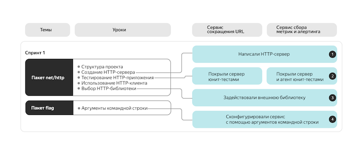
</a>

<a href="docs/images/sprint1-evo.png">
  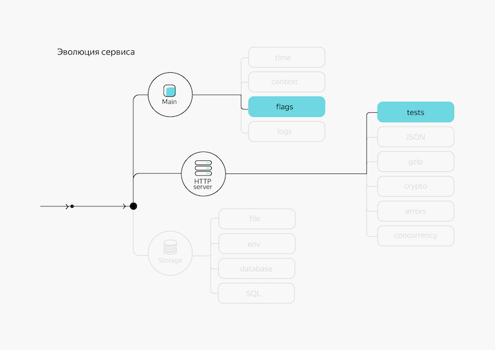
</a>

---

## Спринт 2

### Инкремент 5

Доработайте агент, чтобы он мог изменять свои параметры запуска по умолчанию через переменные окружения:

- `ADDRESS` отвечает за адрес эндпоинта HTTP-сервера.
- `REPORT_INTERVAL` позволяет переопределять `reportInterval`.
- `POLL_INTERVAL` позволяет переопределять `pollInterval`.

Значения интервалов времени должны задаваться в секундах.

Доработайте сервер, чтобы он мог изменять свои параметры запуска по умолчанию через переменные окружения:

- `ADDRESS` отвечает за адрес эндпоинта HTTP-сервера.

Приоритет параметров должен быть таким:

- Если указана переменная окружения, то используется она.
- Если нет переменной окружения, но есть аргумент командной строки (флаг), то используется он.
- Если нет ни переменной окружения, ни флага, то используется значение по умолчанию.

**Задачи**

- #13. Добавить новый источник конфигурации (из переменных окружения) для Сервера
- #14. Добавить новый источник конфигурации (из переменных окружения) для Агента

---

### Инкремент 6

Реализуйте логирование сведений о запросах и ответах на сервере для всех эндпоинтов, которые у вас уже есть.

- Сведения о запросах должны содержать URI, метод запроса и время, затраченное на его выполнение.
- Сведения об ответах должны содержать код статуса и размер содержимого ответа.

Эту функциональность нужно реализовать через `middleware`. Используйте один из сторонних пакетов для логирования:

- `github.com/rs/zerolog`,
- `go.uber.org/zap`, <-
- `github.com/sirupsen/logrus`.

Все сообщения логгера должны быть на уровне `Info`.

**Задачи**

- #15. Добавить логирование запросов/ответов Сервера

---

### Инкремент 7

Дополните API сервера, чтобы позволить ему принимать метрики в формате `JSON`.

При реализации задействуйте одну из распространённых библиотек:

- `encoding/json` <-
- `github.com/mailru/easyjson`
- `github.com/pquerna/ffjson`
- `github.com/labstack/echo`
- `github.com/goccy/go-json`

Двухсторонний обмен данными между агентом и сервером организуйте с использованием следующей структуры:

```go
type Metrics struct {
    ID    string   `json:"id"`              // имя метрики
    MType string   `json:"type"`            // параметр, принимающий значение gauge или counter
    Delta *int64   `json:"delta,omitempty"` // значение метрики в случае передачи counter
    Value *float64 `json:"value,omitempty"` // значение метрики в случае передачи gauge
} 
```

Добавьте в код сервера новый эндпоинт `POST /update`, принимающий в теле запроса и сохраняющий новые значения метрик. Сервер должен обрабатывать данные в формате `JSON`, указанном выше. Пример запроса к серверу с новыми значениями метрик:

```
POST http://localhost:8080/update HTTP/1.1
Host: localhost:8080
Content-Type: application/json
{
  "id": "LastGC",
  "type": "gauge",
  "value": 1744184459
}
```

Добавьте в код сервера новый эндпоинт `POST /value`, возвращающий актуальные значения собранных метрик. В теле запроса отправьте описанный выше `JSON` с заполненными полями `ID` и `MType`. В теле ответа от сервера должен приходить такой же `JSON`, но с уже заполненными значениями метрик.

Пример запроса к серверу:

```
POST http://localhost:8080/value HTTP/1.1
Host: localhost:8080
Content-Type: application/json
{
  "id": "LastGC",
  "type": "gauge"
}
```

Пример ответа сервера:

```
POST http://localhost:8080/update HTTP/1.1
Host: localhost:8080
Content-Type: application/json
{
  "id": "LastGC",
  "type": "gauge",
  "value": 1744184459
}
```

Переведите агент на отправку метрик через новый эндпоинт `POST /update`. Удостоверьтесь, что в запросах и ответах присутствует HTTP-заголовок `Content-Type` со значением `application/json`. Он указывает агенту и серверу, в каком формате передано тело ответа.

Автотесты проверяют, что агент экспортирует и обновляет на сервере метрики, описанные в первых инкрементах.

**Задачи**

- #16. Добавить API-метод: POST /update
- #17. Добавить API-метод: POST /value
- #18. Перевести Агент на отправку метрик через POST /update

---

### Инкремент 8

Добавьте поддержку `gzip` в код сервера и агента. Научите:

- Агента передавать данные в формате `gzip`.
- Сервер опционально принимать запросы в сжатом формате (при наличии соответствующего HTTP-заголовка `Content-Encoding`).
- Отдавать сжатый ответ клиенту, который поддерживает обработку сжатых ответов (с HTTP-заголовком `Accept-Encoding`).

Функция сжатия должна работать для контента с типами `application/json` и `text/html`.

Вспомните `middleware` из урока про HTTP-сервер — это может вам помочь.

**Задачи**

- #19. Добавить `gzip` для Сервера
- #20. Добавить `gzip` для Агента
- #21. Ограничить gzip-сжатие только JSON и HTML

---

### Инкремент 9

Доработайте код сервера, чтобы он мог с заданной периодичностью сохранять текущие значения метрик на диск в указанный файл, а на старте — опционально загружать сохранённые ранее значения.

Сервер должен принимать соответствующие параметры конфигурации через флаги и переменные окружения:

- Флаг `-i`, переменная окружения `STORE_INTERVAL` — интервал времени в секундах, по истечении которого текущие показания сервера сохраняются на диск (по умолчанию 300 секунд, значение 0 делает запись синхронной).

- Флаг `-f`, переменная окружения `FILE_STORAGE_PATH` — путь до файла, куда сохраняются текущие значения. Имя файла для значения по умолчанию придумайте сами.

- Флаг `-r`, переменная окружения `RESTORE` — булево значение (true/false), определяющее, следует ли загружать ранее сохранённые значения из указанного файла при старте сервера.

Пример содержимого файла:

```
[
  {"id":"LastGC","type":"gauge","value":1257894000000000000},
  {"id":"NumGC","type":"counter","delta":42},
  ...
]
```

Приоритет параметров сервера должен быть таким:

- Если указана переменная окружения, то используется она.
- Если нет переменной окружения, но есть флаг, то используется он.
- Если нет ни переменной окружения, ни флага, то используется значение по умолчанию.

**Задачи**

- #22. Добавить в конфигурацию Сервера новые параметры управления персистентностью
- #23. Реализовать сохранение метрик Сервера в файл
- #24. Реализовать восстановление метрик Сервера из файла при старте
- #25. Реализовать периодическое сохранение метрик по таймеру
- #26. Реализовать синхронную запись метрик на диск

---

### Итоги спринта 2

<a href="docs/images/sprint2-path.png">
  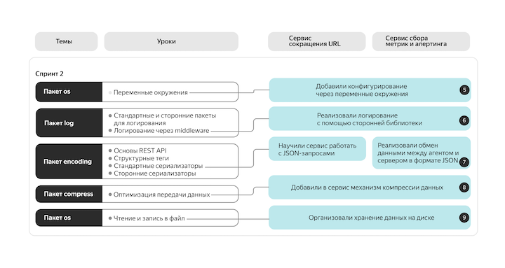
</a>

<a href="docs/images/sprint2-evo.png">
  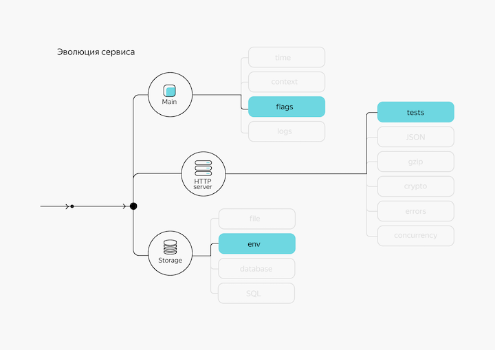
</a>

---

## Спринт 3

### Инкремент 10

Сервер:

- Добавьте функциональность подключения к базе данных. В качестве СУБД используйте `PostgreSQL` не ниже 10 версии.

- Добавьте в сервер хендлер `GET /ping`, который при запросе проверяет соединение с базой данных. При успешной проверке хендлер должен вернуть HTTP-статус `200 OK`, при неуспешной — `500 Internal Server Error`.

Строка с адресом подключения к БД должна получаться из переменной окружения `DATABASE_DSN` или флага командной строки `-d`.

Для работы с БД используйте один из следующих пакетов:

- `database/sql`, <-
- `github.com/jackc/pgx`, <-
- `github.com/lib/pq`,
- `github.com/jmoiron/sqlx`.

**Задачи**

- #27. Добавить новый флаг/переменную окружения (-d/DATABASE_DSN) для конфигурации Сервера
- #28. Добавить подключение к БД
- #29. Добавить handler /ping для проверки соединения с БД

---

### Инкремент 11

Доработайте сервис и добавьте поддержку СУБД `PostgreSQL` для хранения метрик.

Сервису нужно самостоятельно создать все необходимые таблицы в базе данных. Схема и формат хранения остаются на ваше усмотрение.

Используйте инструмент миграций для создания и изменения схемы базы данных.

Для хранения значений `gauge` рекомендуется использовать тип `double precision`.

При отсутствии переменной окружения `DATABASE_DSN` или флага командной строки `-d` либо при их пустых значениях, вернитесь последовательно к:

- хранению метрик в файле — при наличии соответствующей переменной окружения или флага командной строки;
- хранению метрик в памяти.

**Задачи**

- #30. Спроектировать схему хранения метрик в PostgreSQL
- #31. Подключить инструмент миграций (golang-migrate)
- #32. Создать миграции для схемы БД
- #33. Запускать миграции при старте сервера
- #34. Реализовать PostgreSQL-хранилище метрик

---

### Инкремент 12

Сервер:

- Добавьте новый хендлер POST `/updates/`, принимающий в теле запроса множество метрик в формате: `[]Metrics` (списка метрик).

Агент:

- Научите агент работать с использованием нового API (отправлять метрики батчами).

Стоит помнить, что:

- нужно соблюдать обратную совместимость;
- отправлять пустые батчи не нужно;
- вы умеете сжимать контент по алгоритму `gzip`;
- изменение в базе можно выполнять в рамках одной транзакции или одного запроса;
- необходимо избегать формирования условий для возникновения состояния гонки (race condition).

**Задачи**

- #35. Добавить API-метод: POST /updates на Сервере
- #36. Реализовать вызов /updates Агентом

---

### Инкремент 13

Измените весь свой код в соответствии со знаниями, полученными в этой теме. Добавьте обработку retriable-ошибок.

Сценарии возможных ошибок:

- Агент не сумел с первой попытки выгрузить данные на сервер из-за временной невозможности установить с ним соединение.
- При обращении к `PostgreSQL` cервер получил ошибку транспорта (из категории Class 08 — `Connection Exception`).

Стратегия реализации:

- Количество повторов должно быть ограничено тремя дополнительными попытками.
- Интервалы между повторами должны увеличиваться: 1s, 3s, 5s.
- Чтобы определить тип ошибки `PostgreSQL`, с которой завершился запрос, можно воспользоваться библиотекой `github.com/jackc/pgerrcode`, в частности `pgerrcode.UniqueViolation`.

**Задачи**

- #37. Добавить retry-логику в Агент при сетевых ошибках отправки метрик

  см. также задачу #48 (Спринт 4, Инкремент 15)

- #38. Добавить retry-логику при Connection Exception ошибках PostgreSQL на Сервере

---

### Итоги спринта 3

<a href="docs/images/sprint3-path.png">
  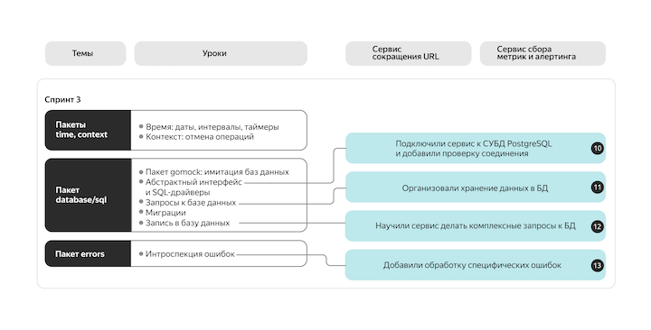
</a>

<a href="docs/images/sprint3-evo.png">
  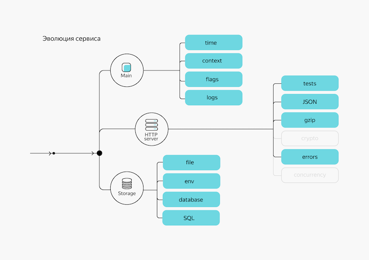
</a>

---

## Спринт 4

### Инкремент 14

Реализуйте механизм подписи передаваемых данных по алгоритму `SHA256`. Для этого посчитайте hash от всего тела запроса и разместите его в HTTP-заголовке `HashSHA256`.

Хеш нужно считать от строки с учётом ключа, который передан агенту/серверу на старте: `hash(value, key)`.

Агент:

- Добавьте поддержку аргумента через флаг `-k=<КЛЮЧ>` и переменную окружения `KEY=<КЛЮЧ>`.
- При наличии ключа агент должен вычислять хеш и передавать в HTTP-заголовке запроса с именем `HashSHA256`.

Сервер:

- Добавьте поддержку аргумента через флаг `-k=<КЛЮЧ>` и переменную окружения `KEY=<КЛЮЧ>`.
- При наличии ключа во время обработки запроса сервер должен проверять соответствие полученного и вычисленного хеша.
- При несовпадении сервер должен отбрасывать полученные данные и возвращать `http.StatusBadRequest`.
- При наличии ключа на этапе формирования ответа сервер должен вычислять хеш и передавать его в HTTP-заголовке ответа с именем `HashSHA256`.

Внимание! Это учебный пример, в котором сделан акцент на закреплении пройденной темы, а не на безопасности. В реальной жизни использовать подпись таким образом не следует. Остаётся возможность передать серверу перехваченные ранее данные с корректным хешем (старое значение счётчика).

**Задачи**

- #39. Добавить поддержку ключа KEY (флаг -k и env KEY) в конфигурацию Агента
- #40. Добавить поддержку ключа KEY (флаг -k и env KEY) в конфигурацию Сервера
- #41. Добавить в Агенте вычисление хеша тела запроса и его отправку
- #42. Добавить проверку хеша входящего запроса на Сервере
- #43. Добавить отправку хеша ответа на Сервере

---

### Инкремент 15

Перепланируйте архитектуру агента таким образом, чтобы сбор метрик (опрос runtime) и их отправка осуществлялись в разных горутинах. При этом количество одновременно исходящих запросов на сервер нужно ограничивать «сверху».

Соответствующее значение должно задаваться аргументами:

- Через флаг `-l=<ЗНАЧЕНИЕ>` и переменную окружения `RATE_LIMIT`.

Совет:

- Используйте паттерн **worker pool**.

Добавьте ещё одну горутину, которая будет использовать пакет `gopsutil` и собирать дополнительные метрики типа `gauge`:

- `TotalMemory`,
- `FreeMemory`,
- `CPUutilization1` (точное количество — по числу CPU, определяемому во время исполнения).

**Задачи**

- #44. Добавить поддержку параметра RateLimit (флаг -l) в конфигурацию Агента
- #45. Разнести сбор runtime-метрик и их отправку по разным горутинам
- #46. Добавить отдельную горутину для сбора системных метрик через gopsutil
- #47. Ограничить количество одновременно исходящих запросов к Серверу

- #48. Добавить ретраи 429/5xx HTTP-ошибок Агента - 48

  при ревью, попросили добавить ошибки 429 и 5xx в логику ретраев (см. Спринт 3, Инкремент 13, Задача #37)

**Архитектурные мысли**

Декомпозируем на конкурентные задачи:

1. Сбор runtime-метрик
2. Сбор системных метрик
3. Отправка метрик на Сервер по HTTP

Получается такая картина:

- задачи 1 и 2 - сборщики - они обновляют общее хранилище метрик
- задача 3 - отправитель - читает из этого же общего хранилища
- состояние живое и меняется на ходу

Риск такой схемы:

- отправить нестрого согласованный snapshot

В задании просят реализовать отправку через worker pool, получается:

- каждые `REPORT_INTERVAL` report() формирует (но только если счётчик pollSinceReport != 0) полный batch и кладет его в очередь

- свободный воркер-отправщик берет задание из очереди отправляет его на Сервер (воркеров не может быть больше, чем значение `RATE_LIMIT`)

- при этом на стороне Сервера у нас сейчас тоже общее состояние, а не time-series, поэтому теоретически может записаться более старое состояние метрик (которое шло по сети дольше), поверх более нового ... в смысле, при дефолтных значениях флагов -p и -r это крайне маловероятно, но в ситуациях, когда rate limit начнет срабатывать, вероятность возрастает

---

### Итоги спринта 4

<a href="docs/images/sprint4-evo.png">
  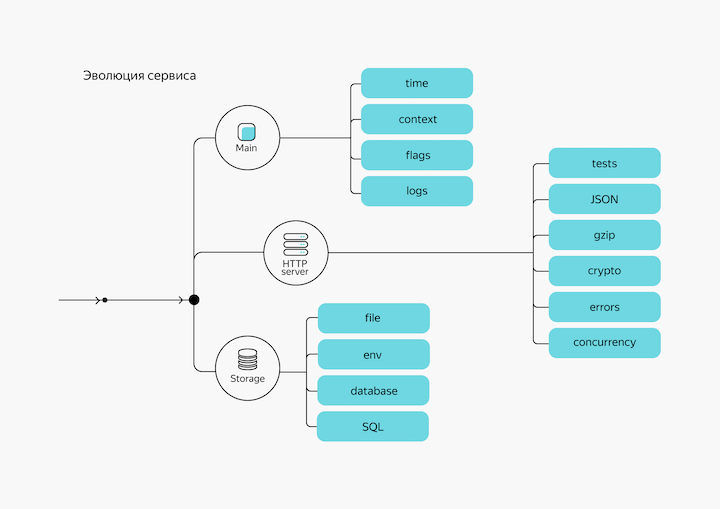
</a>

---

## Спринт 5

Спринт 5 был посвящён проекту [**(^.^)~ Gophermart**](https://github.com/xhrobj/gophermart).

---

### Итоги спринтов 1 - 5

<a href="docs/images/sprint1-5-path.png">
  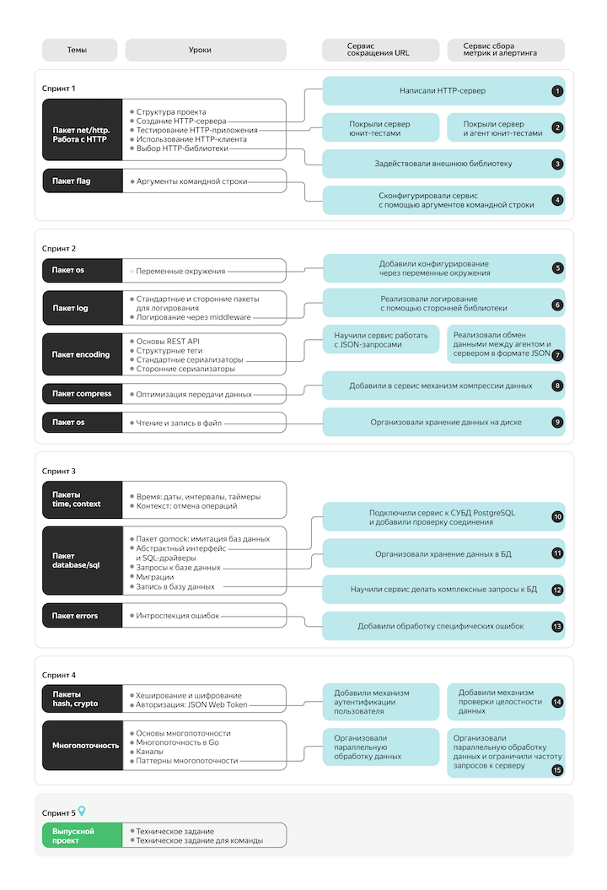
</a>

---

## Спринт 6

### Инкремент 16

С помощью паттерна «Наблюдатель» добавьте в сервис функциональность аудита запросов.

Добавьте в сервер параметры конфигурации:

- Флаг `--audit-file`, переменная окружения `AUDIT_FILE` — путь к файлу, в который сохраняются логи аудита. Если параметр не передан, аудит должен быть отключён.
- Флаг `--audit-url`, переменная окружения `AUDIT_URL` — полный URL, по которому отправляются логи аудита. Если параметр не передан, аудит должен быть отключён.

Формат события аудита:

```text
{
  "ts": 12345678, // unix timestamp события
  "metrics": ["Alloc", "Frees", ...], // наименование полученных метрик
  "ip_address": "192.168.0.42" // IP адрес входящего запроса
}
```

После успешной обработки полученных сервером метрик необходимо сформировать сообщение события аудита и отправить его во все доступные приёмники аудита.

Для файла-приёмника добавление происходит в конец файла, указанного в параметре конфигурации, на новой строке.

Для удалённого сервера-приёмника отсылка выполняется методом POST по URL, указанному в параметре конфигурации.

**Задачи**

- #49. Добавить параметры Аудита (флаги: --audit-file, --audit-url и env'ы: AUDIT_FILE, AUDIT_URL) в конфигурацию Сервера
- #50. Добавить пакет Аудита на основе паттерна Наблюдатель (Event, Observer, Auditor/dispatcher)
- #51. Добавить Observer, который пишет Аудит в указанный файл (записывает Event JSON-строкой в файл)
- #52. Добавить Observer, который отправляет Аудит (Event) методом POST на указанный URL
- #53. Подключить Аудит к успешной обработке входящих метрик на Сервере

---

### Инкремент 17

Добавьте в свой проект бенчмарки, измеряющие скорость выполнения важнейших компонентов вашей системы.

Проведите анализ использования памяти вашим проектом, определите и исправьте неэффективные части кода по следующему алгоритму:

1. Используя профилировщик `pprof`, сохраните профиль потребления памяти вашим проектом в директорию `profiles` с именем `base.pprof`
2. Изучите полученный профиль:
  - используйте команды `top`, `list`, `web`, `peek` в `pprof`;
  - обратите внимание на количество аллокаций, удерживаемую память и «тяжёлые» функции.
3. Оптимизируйте код, убрав избыточные аллокации или переписав неэффективные участки кода
4. Снимите профиль повторно, сохраните его как `profiles/result.pprof`

Проверьте результат внесённых изменений командой:

```bash
pprof -top -diff_base=profiles/base.pprof profiles/result.pprof
```

Если всё сделано правильно, вы увидите отрицательные значения — показатель того, что использование памяти уменьшилось. Добавьте полученный вывод в README.md.

**Задачи**

- #54. Добавить бенчмарки для выбранных компонентов системы (хранилища метрик и HTTP-обработчиков)
- #55. Снять базовый профиль памяти `profiles/base.pprof`
- #56. Оптимизировать лишние аллокации, которые будут найдены через `pprof`
- #57. Снять повторный профиль памяти `profiles/result.pprof` и сравнить его с базовым
- #58. Зафиксировать результаты benchmark'ов и профилирования в README

**Результаты**

Добавлены бенчмарки для выбранных компонентов системы:

- `BenchmarkMemStorage_UpdateMetrics`
- `BenchmarkMemStorage_Snapshot`
- `BenchmarkHandler_UpdateJSON`
- `BenchmarkHandler_UpdatesJSON`

Для запуска бенчмарков использовалась команда:

```bash
go test -bench=. -benchmem ./internal/repository ./internal/handler
```

Основной сценарий для оптимизации - batch-обработчик `/updates`.

До оптимизации:

```text
BenchmarkHandler_UpdatesJSON-8 56247 21283 ns/op 18150 B/op
```

Базовый профиль памяти был снят командой:

```bash
go test -run=^$ \
  -bench=BenchmarkHandler_UpdatesJSON \
  -benchmem \
  -benchtime=100000x \
  -memprofilerate=1 \
  -memprofile=profiles/base.pprof \
  ./internal/handler
```

В базовом профиле была найдена лишняя аллокация в `handler.metricIDs`: список имён метрик создавался даже при выключенном аудите.

После оптимизации `metricIDs` вызывается только если аудит действительно включен. Затем был снят повторный профиль памяти `profiles/result.pprof`

Результат после оптимизации:

```text
BenchmarkHandler_UpdatesJSON-8 56540 21235 ns/op 17638 B/op
```

Сравнение профилей:

```bash
go tool pprof -top -alloc_space -diff_base=profiles/base.pprof profiles/result.pprof
```

Результат сравнения:

```text
flat       flat%   sum%    cum        cum%
-48.83MB   2.82%   2.82%   -48.83MB   2.82%  github.com/xhrobj/go-metrics-and-alerts/internal/handler.metricIDs
```

После оптимизации на `100000` batch-запросов убрано около `48.83MB` лишних аллокаций. В бенчмарке это соответствует уменьшению памяти и количества аллокаций:

```text
до:    18150 B/op    131 allocs/op
после: 17638 B/op    130 allocs/op
```

---

### Инкремент 18

Отформатируйте свой проект с помощью `gofmt` или `goimports`. Убедитесь, что все файлы проекта прошли форматирование.

Внимание: к концу текущего спринта покрытие вашего кода тестами должно быть не менее 40%.

**Результаты**

Форматирование Go-файлов проверено командой:

```bash
gofmt -l $(git ls-files '*.go')
```

Команда не вывела файлов, требующих форматирования.

Покрытие проверено командами:

```bash
go test -coverprofile=coverage.out ./...
go tool cover -func=coverage.out | tail -n 1
```

Итоговое покрытие на текущий момент выше требуемых 40%

---

### Инкремент 19

Добавьте к основным экспортированным методам и переменным (хендлерам, публичным структурам и интерфейсам) в вашем проекте документацию в формате `godoc`.

Добавьте примеры работы с эндпоинтами практического трека в формате `example_test.go`.

**Задачи**

- #59. Проверить и, при необходимости, добавить недостающие godoc-комментарии к экспортируемым сущностям
- #60. Добавить примеры работы с эндпоинтами

**Результаты**

Добавлены исполняемые examples для основных HTTP-эндпоинтов:
- обновление и чтение метрики через legacy path endpoints
- обновление и чтение метрики через JSON endpoints
- пакетное обновление метрик через `/updates`

Локальная документация запускается командой:

```bash
"$(go env GOPATH)/bin/pkgsite"
```

После запуска `pkgsite` примеры доступны в браузере:

```text
http://localhost:8080/github.com/xhrobj/go-metrics-and-alerts/internal/router#pkg-examples
```

<a href="docs/images/increment-19-pkgsite-examples.png">
  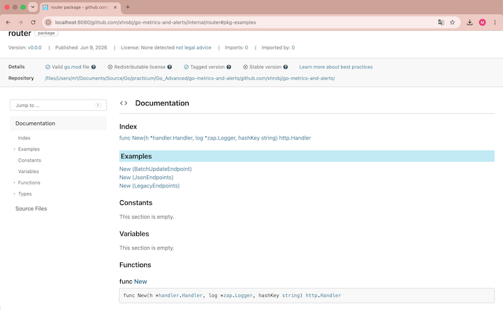
</a>

---

### Итоги спринта 6

<a href="docs/images/sprint6-path.png">
  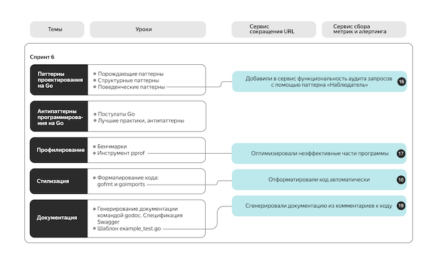
</a>

<a href="docs/images/sprint6-evo.png">
  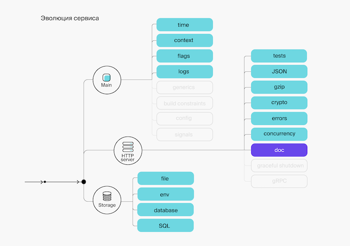
</a>

---

## Спринт 7

### Инкремент 20

Создайте свой `multichecker`, состоящий из:

- стандартных статических анализаторов пакета `golang.org/x/tools/go/analysis/passes`;
- всех анализаторов класса `SA` пакета `staticcheck.io`;
- не менее одного анализатора остальных классов пакета `staticcheck.io`;
- двух или более любых публичных анализаторов на ваш выбор.

Напишите и добавьте в `multichecker` собственный анализатор, запрещающий использовать прямой вызов `os.Exit` в функции `main` пакета `main`. При необходимости перепишите код своего проекта так, чтобы он удовлетворял данному анализатору.

Поместите анализатор в директорию `cmd/staticlint` вашего проекта. Добавьте документацию в формате `godoc`, подробно опишите в ней механизм запуска `multichecker`, а также каждый анализатор и его назначение.

Исходный код вашего проекта должен проходить статический анализ созданного `multichecker`.

Покрытие вашего кода тестами к концу спринта должно быть не менее 55%.

**Задачи**

- #61. Подготовить фикстуры для собственного анализатора запрета os.Exit main
- #62. Реализовать собственный анализатор запрета os.Exit в main
- #63. Собрать multichecker, включающий анализатор запрета os.Exit в main

**Результаты**

Добавлена утилита `cmd/staticlint`, которая запускает собственный `multichecker` проекта. Анализатор `noosexit` запрещает прямой вызов `os.Exit` внутри функции `main` пакета `main`.

Для запуска `staticlint` добавлена команда:

```bash
make staticlint
```

---

### Инкремент 21

Добавьте к проекту утилиту, которая будет генерировать функции очистки для произвольных структур.

В директории `./cmd/reset/` вашего проекта создайте исполняемый файл `main.go`, который будет отвечать за генерацию функций. В этом файле реализуйте следующий алгоритм:

- просканировать все пакеты, начиная с корневой директории и ниже;
- для каждого пакета найти все структуры, над которыми стоит комментарий `// generate:reset`;
- для каждой найденной структуры сгенерировать метод `Reset()`;
- все сгенерированные методы для структур одного пакета должны находиться в файле `reset.gen.go` этого же пакета.

Реализация метода `Reset()` должна сбрасывать состояние объекта структуры к начальным значениям по следующим правилам:

- примитивы приводятся к своим нулевым значениям: `int` сбрасывается к `0`, `string` сбрасывается в `""`, `bool` сбрасывается в `false` и так далее;
- слайсы обрезаются по длине, но не зануляются, например поле `strings []string` должно сброситься к `strings[:0]`;
- мапы очищаются, для этого можно использовать встроенную функцию `clear`;
- вложенные структуры, если они обладают методом `Reset()`, должны вызвать этот метод;
- все не `nil` указатели должны сбросить свои значения по правилам выше.

Чтобы лучше понять, о чём идёт речь, рассмотрим пример структуры:

```go
// generate:reset
type ResetableStruct struct {
    i     int
    str   string
    strP  *string
    s     []int
    m     map[string]string
    child *ResetableStruct
}
```

Метод сброса для такой структуры может выглядеть так:

```go
func (rs *ResetableStruct) Reset() {
    if rs == nil {
        return
    }

    rs.i = 0
    rs.str = ""
    if rs.strP != nil {
        *rs.strP = ""
    }
    rs.s = rs.s[:0]
    clear(rs.m)
    if resetter, ok := rs.child.(interface{ Reset() }); ok && rs.child != nil {
        resetter.Reset()
    }
}
```

**Задачи**

- #64. Подготовить фикстуры для генератора Reset-методов
- #65. Реализовать генерацию reset.gen.go для структур с "аннотацией" generate:reset
- #66. Добавить утилиту cmd/reset и Makefile-команды

**Результаты**

Добавлена утилита `cmd/reset`, которая сканирует Go-пакеты проекта, находит структуры с комментарием `// generate:reset` и генерирует для них методы `Reset()` в файлах `reset.gen.go`.

Для запуска генератора добавлена команда:

```bash
make generate-reset
```

Для удаления сгенерированных reset.gen.go, команда:

```bash
make clean-generated
```

---

### Инкремент 22

В уроке про многопоточность мы рассказывали, как с помощью `sync.Pool` можно повторно использовать «тяжёлые» объекты. Очень важно перед возвратом объекта в пул выполнять «сброс» его состояния.

В прошлом инкременте мы просили вас реализовать генератор функций сброса для произвольных структур. В этом инкременте вам необходимо создать собственную структуру, которая будет представлять собой контейнер для таких структур.

Более формально: вам необходимо реализовать структуру с generic-параметром, которая сможет хранить в себе объекты одного конкретного типа. Более того, такие объекты должны обладать методом `Reset()`, о котором мы рассказывали в прошлом инкременте.

Итоговый файл должен содержать:

- Структуру `Pool` с generic-параметром, который ограничен типами с методом `Reset()`;
- Функцию-конструктор `New`, которая создаёт и возвращает указатель на структуру `Pool`;
- Метод `Get()` структуры `Pool`, который возвращает объект из пула;
- Метод `Put()` структуры `Pool`, который помещает объект в пул.

**Задачи**

- #67. Реализация generic-пула для объектов с Reset

**Результаты**

В pkg/pool добавлен generic-пул для объектов с методом Reset(). Добавлены godoc-описание пакета и исполняемый пример использования.

---

### Инкремент 23

Добавьте в пакеты `cmd/server` и `cmd/agent` глобальные переменные:

- `var buildVersion string`,
- `var buildDate string`,
- `var buildCommit string`.

При старте приложения выводите в stdout сообщение в следующем формате:

```text
Build version: <buildVersion> (или "N/A" при отсутствии значения)
Build date: <buildDate> (или "N/A" при отсутствии значения)
Build commit: <buildCommit> (или "N/A" при отсутствии значения)
```

**Задачи**

- #68. Добавить информацию о сборке и ее вывод при старте Агента и Сервера

---

### Итоги спринта 7

<a href="docs/images/sprint7-path.png">
  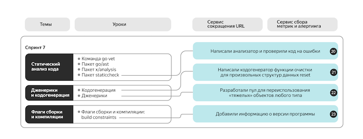
</a>

<a href="docs/images/sprint7-evo.png">
  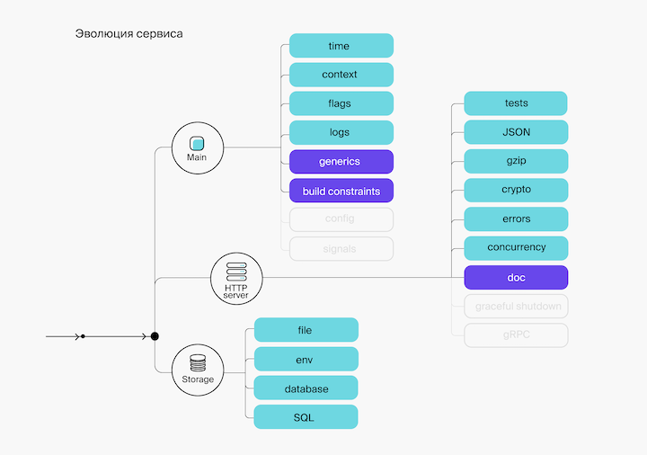
</a>

---

## Спринт 8

### Инкремент 24

Добавьте в агент и сервер поддержку асимметричного шифрования.

- Для агента: с помощью флага `-crypto-key` или переменной окружения `CRYPTO_KEY` передайте путь до файла с публичным ключом.
- Для сервера: с помощью флага `-crypto-key` или переменной окружения `CRYPTO_KEY` передайте путь до файла с приватным ключом.

Шифруйте сообщения от агента к серверу с помощью ключей.

**Задачи**

- #69. Добавить в конфигурацию Агента и Сервера параметр CryptoKey
- #70. Добавить пакет для шифрования
- #71. Встроить шифрование в Агент и дешифрование в Сервер

---

### Инкремент 25

Добавьте возможность конфигурации сервера и агента с помощью файла в формате `JSON`. Нужно поддержать все действующие опции приложения. Имя файла конфигурации должно задаваться через флаг `-c`/`-config` или переменную окружения `CONFIG`. Значения из файла конфигурации должны иметь меньший приоритет, чем флаги или переменные окружения.

Формат файла для сервера:

```json
{
    "address": "localhost:8080", // аналог переменной окружения ADDRESS или флага -a
    "restore": true, // аналог переменной окружения RESTORE или флага -r
    "store_interval": "1s", // аналог переменной окружения STORE_INTERVAL или флага -i
    "store_file": "/path/to/file.db", // аналог переменной окружения STORE_FILE или -f
    "database_dsn": "", // аналог переменной окружения DATABASE_DSN или флага -d
    "crypto_key": "/path/to/key.pem" // аналог переменной окружения CRYPTO_KEY или флага -crypto-key
} 
```

Формат файла для агента:

```json
{
    "address": "localhost:8080", // аналог переменной окружения ADDRESS или флага -a
    "report_interval": "1s", // аналог переменной окружения REPORT_INTERVAL или флага -r
    "poll_interval": "1s", // аналог переменной окружения POLL_INTERVAL или флага -p
    "crypto_key": "/path/to/key.pem" // аналог переменной окружения CRYPTO_KEY или флага -crypto-key
} 
```

**Задачи**

- #72. Добавить в конфигурацию Агента и Сервера параметр CONFIG
- #73. Добавить загрузку конфигурации Сервера из JSON-файла
- #74. Добавить загрузку конфигурации Агента из JSON-файла

**Заметки**

- В описании задания есть несоответствие. В инкременте 9 для флага `-f`, задающего путь к файлу хранения текущих значений метрик, была введена переменная окружения `FILE_STORAGE_PATH`. В описании инкремента 25, в примере json-файла конфигурации, для того же параметра указана переменная окружения `STORE_FILE`. Будем поддерживать обе переменные, при этом новая переменная `STORE_FILE` будет иметь более высокий приоритет. В JSON-файле для этого параметра будем поддерживать поле `store_file`.

---

### Инкремент 26

Агент и сервер должны штатно завершаться по сигналам: `syscall.SIGTERM`, `syscall.SIGINT`, `syscall.SIGQUIT`.

Данные, которые находятся в процессе обработки на момент получения сигнала, должны быть успешно переданы агентом на сервер, а сервер должен успешно сохранить все несохранённые данные.

**Задачи**

- #75. Добавить graceful shutdown для Агента
- #76. Добавить graceful shutdown для Сервера

**Результаты**

Реализация проверена запуском Агента и Сервера через Docker Compose с последующим завершением контейнеров командой `docker compose down`.

Фрагмент лога подтверждает последовательность graceful shutdown: после получения сигнала Агент выполнил финальную отправку метрик, дождался успешного ответа Сервера и завершился с кодом 0. После этого Сервер также завершился штатно.

Сигнал Агенту -> финальный `POST /updates` со статусом `200` -> штатное завершение Агента -> штатное завершение Сервера:

```text
...

agent-1     | {"level":"info","ts":1781506587.7904048,"caller":"agent/agent.go:138","msg":"shutdown signal received"}
server-1    | {"level":"info","ts":1781506587.799356,"caller":"middleware/logging.go:68","msg":"http request completed","uri":"/updates","method":"POST","duration":0.00625025,"status":200,"size":0}
agent-1     | {"level":"info","ts":1781506587.8001022,"caller":"agent/agent.go:170","msg":"agent stopped"}
agent-1 exited with code 0
server-1    | {"level":"info","ts":1781506587.9483736,"caller":"server/main.go:166","msg":"shutdown signal received"}
server-1    | {"level":"info","ts":1781506587.9486651,"caller":"server/main.go:139","msg":"server stopped"}
server-1 exited with code 0

...
```

---

### Итоги спринта 8

<a href="docs/images/sprint8-path.png">
  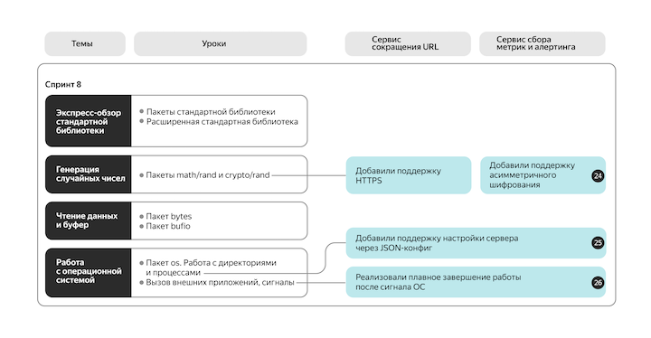
</a>

<a href="docs/images/sprint8-evo.png">
  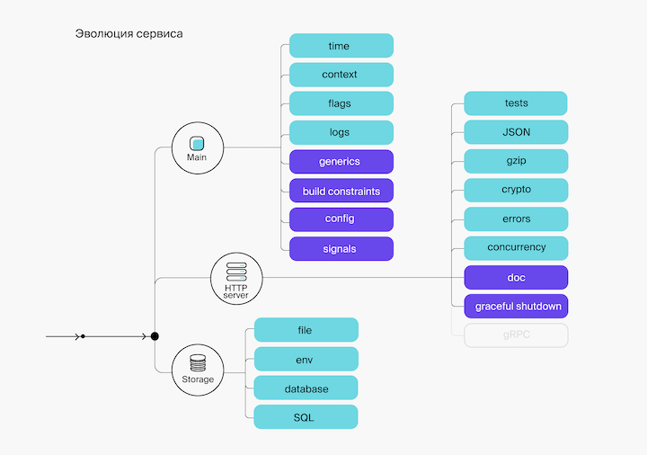
</a>

---

## Спринт 9

### Инкремент 27

Добавьте в конфигурационный JSON-файл сервера поле `trusted_subnet` (тип `string`, переменная окружения `TRUSTED_SUBNET`, флаг `-t`), в которое можно передать строковое представление бесклассовой адресации (CIDR).

Добавьте в запрос агента заголовок `X-Real-IP`, в котором должен содержаться IP-адрес хоста агента.

При отправке метрик агентом серверу нужно проверять, что переданный в заголовке запроса `X-Real-IP` IP-адрес агента входит в доверенную подсеть, в противном случае возвращать статус ответа `403 Forbidden`.

При пустом значении переменной `trusted_subnet` метрики должны обрабатываться сервером без дополнительных ограничений.

**Задачи**

- #77. Добавить в конфигурацию Сервера параметр TRUSTED_SUBNET
- #78. Добавить формирование заголовка X-Real-IP на стороне Агента
- #79. Добавить получение заголовка X-Real-IP на стороне Сервера

---
